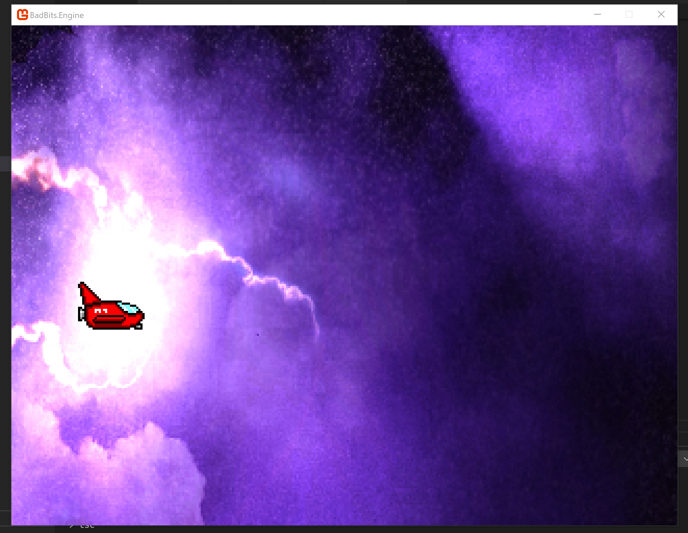

# Bad Bits Engine

_A retro game enspired engine for PC, Mac, and Linux._

## Getting started

Ideally, run these 3 commands, in order, and you should be ready to roll.

`npm install` -- will install the NPM dependencies

`npm run build` -- will build the engine, and the sample program

`npm run start` -- will run the sample program

If you don't have .net core 3.1 installed, you will need this to build the project. [DOWNLOAD](https://dotnet.microsoft.com/download/dotnet-core/3.1) Linux and Mac OSX may have missing base dependencies. If you are testing on these platforms lets figure out some instructions!

## Facts about Bad Bits

* It is written using .NET Framework.

* It interprets Javascript (es5).

* It supports commonJS modules.

* It can be used with typescript! (if you use the typescript compiler)

## Screenshots

https://gfycat.com/periodicimpossibleafricanharrierhawk

## License

Copyright (c) 2020 Joel Longanecker

This software is provided 'as-is', without any express or implied warranty. In no event will the authors be held liable for any damages arising from the use of this software.

Permission is granted to anyone to use this software for any purpose, including commercial applications, and to alter it and redistribute it freely, subject to the following restrictions:

    1. The origin of this software must not be misrepresented; 
        you must not claim that you wrote the original software. 
        If you use this software in a product, an acknowledgment 
        in the product documentation would be appreciated but is 
        not required.

    2. Altered source versions must be plainly marked as such, 
        and must not be misrepresented as being the original 
        software.

    3. This notice may not be removed or altered from any source 
        distribution.

